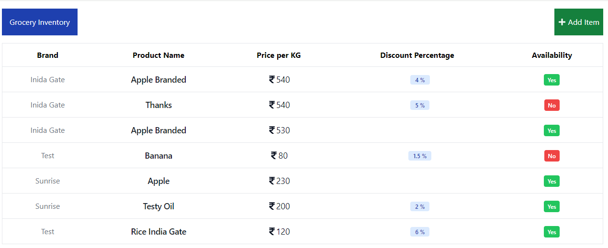

# Grocery Inventory Management

Two endpoints for a grocery inventory management system - a POST
endpoint for adding grocery items to the inventory, and a GET endpoint for
retrieving all items in the inventory.
Used Node and Express for backend
Used React and Vite for frontend


## Setup

Clone the project

```bash
  git clone https://github.com/KaziHasin/grocery-inventory-mern-app.git
```

Go to the project directory

```bash
  cd grocery-inventory-mern-app
```

Install dependencies

```bash
  npm install
```

Install dependencies client

```bash
  cd client
  npm install
```


## Run locally

To run both concurrently with nodmon, 

```bash
  npm run dev
```
To run only server with nodmon, 

```bash
  npm run server
```
To run only client vite 

```bash
  npm run client

  or cd client
  
  npm run dev
```


## API Testing

#### Base URL

```http
  http://localhost:4000
```

#### Get all items

```http
  GET /api/grocery
```
#### Add item

```http
  POST /api/grocery
```


## Note

For sake of simplicity, I added the.env file to this repo.

Demo Video - https://youtu.be/HAuraIYxbfU



